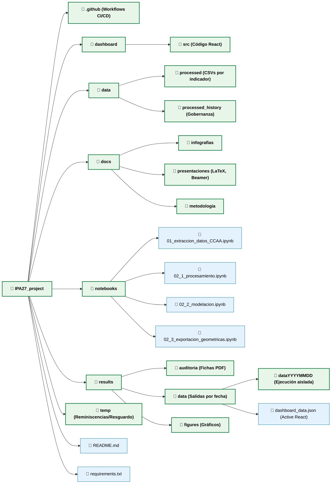

# Índice de Prosperidad Andaluz (IPA27)

[](https://opensource.org/licenses/MIT)
[](https://www.python.org/downloads/)

## Descripción

El **Índice de Prosperidad Andaluz (IPA27)** es un sistema de medición multidimensional del bienestar regional diseñado para el seguimiento trimestral de la prosperidad en Andalucía en comparación con España. Adaptando el marco conceptual del Legatum Prosperity Index a la realidad estadística y política de una región europea, el proyecto busca proveer un análisis métrico sólido.

### Estructura del Índice

El IPA27 se compone de:
- **3 Dominios**: Sociedades Inclusivas, Economías Abiertas, Personas Empoderadas
- **12 Pilares**: 4 pilares por dominio
- **24 Indicadores**: 2 indicadores por pilar

### Innovaciones Metodológicas (Actualización 2026)

1. **Nowcasting integrado**: Pipeline automatizado que combina métodos de Chow-Lin, splines de Denton y modelos ARIMA para unificar series de frecuencias mixtas (mensual, trimestral, anual).
2. **Normalización por Techos Fijos**: Función de transformación anclada en topes estructurales (calculados a partir del promedio del top 3 de los mejores rendimientos históricos y márgenes de proyección). Penaliza la falta de rendimientos y admite elasticidad superior con techos controlados hasta una puntuación de clímax de 120.
3. **Agregación por Media Geométrica Robusta**: A todos los niveles (indicadores a pilares, pilares a dominios y dominios a índice general) se usa una agregación mediante interpolación geométrica de potencias con acotaciones, penalizando la inequidad formativa (no poder compensar falencias graves en un pilar con saltos inmensos en otro).
4. **Organización Dinámica de Salidas por Fecha (`dataYYYYMMDD`)**: Cada ejecución de los cuadernos de procesamiento genera un directorio aislado ordenado por la fecha de ejecución (`results/data/dataYYYYMMDD/`), preservando intacta la trazabilidad y gobernanza de históricos sin sobrescribir ejecuciones pasadas.

---

## Estructura del Proyecto

El repositorio del proyecto sigue una estructura limpia y consolidada para la separación de responsabilidades:

```text
IPA27_project/
├── .github/                     # Workflows de integración continua (deploy del dashboard a GitHub Pages)
├── dashboard/                   # Cuadro de mando interactivo web (Vite + React)
│   └── src/                     # Código fuente de la interfaz de usuario
├── data/                        # Datos históricos y procesados del modelo
│   ├── raw/                     # Datos fuente (archivos de criminalidad, renta, etc.)
│   │   └── archive/             # Histórico de Excel consolidados archivados
│   ├── processed/               # Datos de indicadores individuales extraídos
│   └── processed_history/       # Copias de seguridad de ejecuciones pasadas (gobernanza)
├── docs/                        # Documentación y metodología unificada y organizada:
│   ├── convenios/               # Convenios, contratos y memorias técnicas
│   ├── infografias/             # Infografías del proyecto
│   ├── presentaciones/          # Ficheros de la presentación Beamer (LaTeX) y gráficas
│   └── metodología/             # Todo el material metodológico organizado:
│       ├── 01_general/          # Metodología general y benchmark
│       ├── 02_desafeccion/      # Documentación del índice de desafección
│       ├── 03_participacion_electoral/ # Estudios de participación electoral
│       └── notas_trabajo/       # Borradores y notas técnicas de trabajo
├── formatos y logo/             # Archivos de marca, tipografías, logos y assets visuales
├── notebooks/                   # Jupyter Notebooks de ejecución:
│   ├── 01_extraccion_datos_CCAA.ipynb       # Descarga e integración de APIs y scraping
│   ├── 01_1_indice_desafeccion_cis.ipynb    # Generación del indicador de desafección (CIS)
│   ├── 01_2_participacion_electoral_cis.ipynb # Procesamiento de microdatos electorales
│   ├── 02_1_procesamiento.ipynb             # Preparación de series por frecuencias y alineación
│   ├── 02_2_modelacion.ipynb                # Desestacionalización, trimestralización y nowcast (ARIMA)
│   └── 02_3_exportacion_geometricas.ipynb   # Scores 0-100, agregación, JSON dashboard y Beamer (LaTeX)
├── results/                     # Resultados estadísticos y visuales del proyecto:
│   ├── auditoria/               # Fichas de auditoría analíticas (PDFs)
│   ├── data/                    # Exportaciones por fecha de ejecución y JSON para web:
│   │   ├── dataYYYYMMDD/        # Resultados completos de la ejecución del día (ej. data20260904)
│   │   ├── archive/             # Versiones históricas de ficheros consolidados ipa27_raw
│   │   ├── dashboard_data.json  # Fichero activo sincronizado que alimenta el Cuadro de Mando React
│   │   └── ipa27_raw_YYYYMMDD.xlsx # Archivos Excel brutos consolidados por fecha/vintage
│   ├── figures/                 # Outputs gráficos y de diagnóstico (reporting y dashboards)
│   └── paper_assets/            # Recursos gráficos generados para publicaciones
├── temp/                        # Almacén de desarrollo de ficheros históricos/reminiscencias
├── scripts/                     # Scripts auxiliares y herramientas de desarrollo
├── informe_sociedades_inclusivas.md # Informe analítico
├── README.md                    # Este archivo
└── requirements.txt             # Dependencias del entorno de Python
```

### 🗺️ Mapa Visual de la Estructura en GitHub



---

## Instalación y Configuración

### Requisitos Previos
- Python 3.8 o superior
- Node.js & npm (para ejecutar el dashboard localmente)

### Instalar Dependencias de Python
```bash
pip install -r requirements.txt
```

### Configurar e Iniciar el Dashboard Web
1. Dirígete a la carpeta del dashboard:
   ```bash
   cd dashboard
   ```
2. Instala las dependencias de Node:
   ```bash
   npm install
   ```
3. Lanza el servidor de desarrollo:
   ```bash
   npm run dev
   ```

---

## Uso del Pipeline

### 1. Extracción de Datos (`01_extraccion_datos_CCAA.ipynb`)
Los datos se rescatan automáticamente desde las siguientes plataformas gubernamentales y privadas utilizando APIs y Scraping:
- **INE (Instituto Nacional de Estadística)**
- **IECA (Instituto de Estadística y Cartografía de Andalucía)**
- **Ministerio del Interior (Portal Estadístico de Criminalidad)**
- **CIS (Centro de Investigaciones Sociológicas)**

El output consolidado se guarda automáticamente como `results/data/ipa27_raw_YYYYMMDD.xlsx`.

### 2. Procesamiento y Modelación (`02_1_procesamiento.ipynb`, `02_2_modelacion.ipynb`, `02_3_exportacion_geometricas.ipynb`)
El procesamiento principal sigue las siguientes fases lógicas:
1. **Desestacionalización (STL)**: Depuración de patrones estacionales que ensucian las series de frecuencia mensual o trimestral.
2. **Trimestralización**: Modelos de interpolación por regresores de Chow-Lin y Denton para homogeneizar series de frecuencia mixta (anuales/mensuales).
3. **Nowcasting (ARIMA)**: Rellenado predictivo de retardos de reporte público para el trimestre de cierre actual.
4. **Normalización por Techos Fijos**: Ajuste de los valores al baremo estándar `0-120`.
5. **Agregación Geométrica**: Cálculo del índice de los Pilares, Dominios e IPA27 General mediante medias geométricas.
6. **Exportación Dinámica por Fecha y Sincronización Web**:
   - Genera los datos consolidados del día en `results/data/dataYYYYMMDD/`.
   - Sincroniza automáticamente `results/data/dashboard_data.json` para alimentar en tiempo real la interfaz web React.
   - Genera y escribe el archivo macro de LaTeX `docs/presentaciones/ipa27_variables.tex` y compila la presentación `presentacion_ipa27_v5.tex` a PDF de manera automática.

---

## Indicadores del IPA27

### Dominio 1: Sociedades Inclusivas
- **Pilar 1: Seguridad** (Tasa de Criminalidad Total, Balance de Hurtos y Robos)
- **Pilar 2: Libertad** (Delitos de Odio, Delitos de Libertad Sexual)
- **Pilar 3: Gobernanza** (Índice de Transparencia, Confianza en Gobierno)
- **Pilar 4: Capital Social** (Participación Electoral, Actividad Asociativa)

### Dominio 2: Economías Abiertas
- **Pilar 5: Inversión** (IED, Hipotecas sobre Fincas Urbanas)
- **Pilar 6: Empresas** (Natalidad Empresarial, Constitución Sociedades Mercantiles)
- **Pilar 7: Infraestructura** (Banda Ancha, Transporte de Viajeros)
- **Pilar 8: Calidad Económica** (PIB Trimestral, PIB per Cápita proxy de Rentas Brutas)

### Dominio 3: Personas Empoderadas
- **Pilar 9: Vida** (Tasa AROPE, Tasa de Paro EPA)
- **Pilar 10: Salud** (Esperanza de Vida, Satisfacción Sistema Sanitario)
- **Pilar 11: Educación** (Abandono Escolar Temprano, Educación Superior)
- **Pilar 12: Conocimiento** (Gasto I+D % PIB, Ocupaciones en Sectores de Conocimiento)

---

## Licencia & Actualización

**Última actualización**: Septiembre 2026 (Datos de cierre hasta **2026Q2**)  
**Versión del Índice**: IPA27 (Techos Fijos / Media Geométrica / Gobernanza por Fecha `dataYYYYMMDD`)

