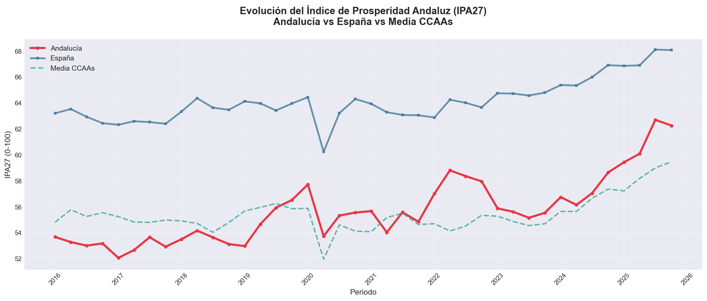
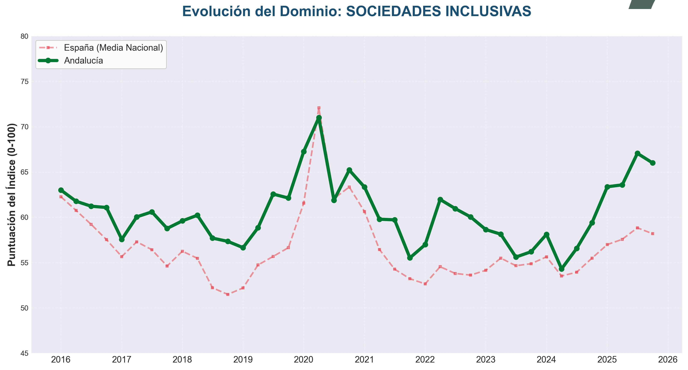
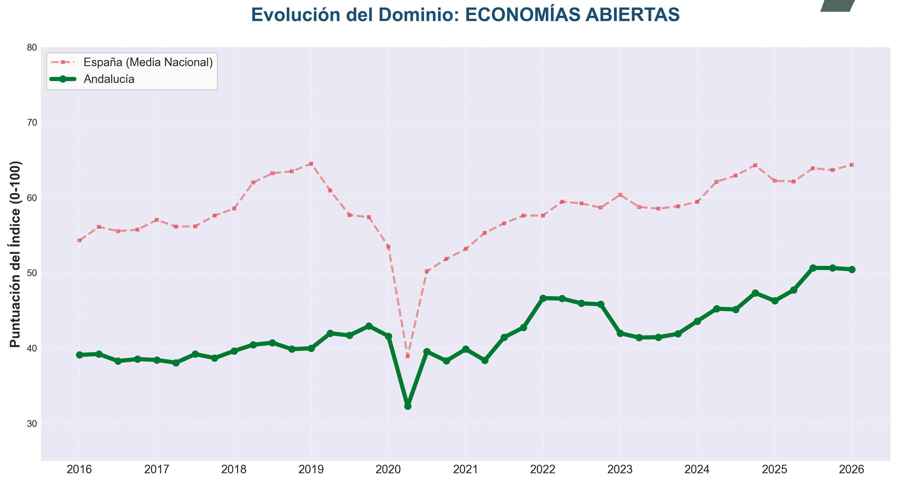
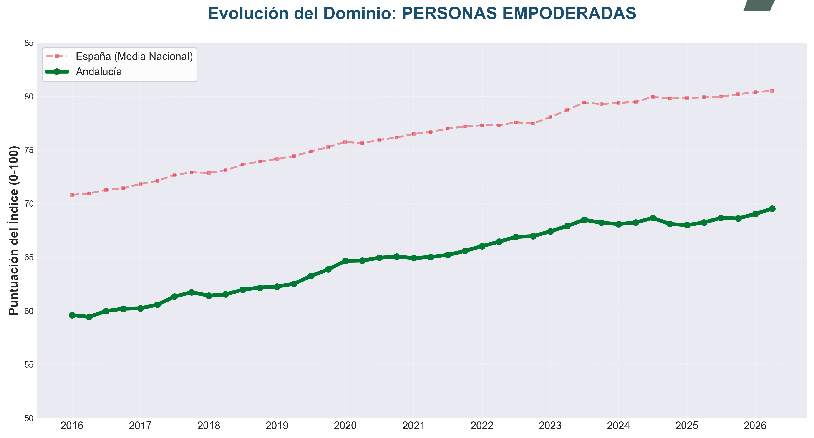
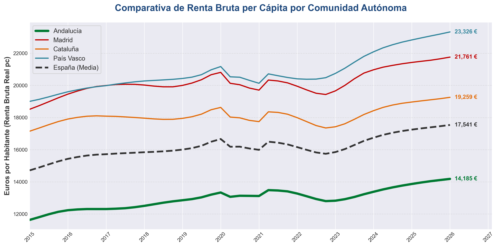
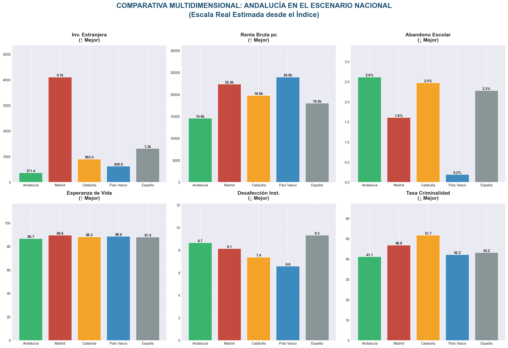

# Ideas Fuerza del Índice de Prosperidad de Andalucía (IPA-27)

Este documento sintetiza los **seis mensajes clave (ideas fuerza)** derivados de los resultados del IPA-27 (cierre en **2026Q1**) para facilitar su comunicación y venta estratégica ante el Patronato de la Fundación. Cada idea se apoya en evidencias empíricas y en la representación gráfica correspondiente.

---

## 1. Progreso Sostenido y Aceleración Reciente
* **Mensaje:** La prosperidad en Andalucía no solo avanza de manera constante a largo plazo, sino que ha iniciado una fase de aceleración muy marcada desde finales de 2023, superando la velocidad media nacional en el último periodo.
* **Datos Clave:** El índice general aumenta **3,4 puntos** (un **5,6%**) desde el inicio de la serie histórica en 2016. Esta mejoría se concentra especialmente a partir del tercer trimestre de 2023, con un incremento reciente de **2,9 puntos** (un **4,7%**) frente al crecimiento de **1,9 puntos** de la media española en ese mismo lapso de tiempo.
* **Evidencia Gráfica:**
  

---

## 2. Liderazgo Social y de Cohesión (Sociedades Inclusivas)
* **Mensaje:** Andalucía se consolida como un referente nacional en cohesión social, gobernanza y seguridad, manteniendo un diferencial positivo muy robusto frente a la media española.
* **Datos Clave:** En el primer trimestre de 2026, Andalucía se sitúa **6,4 puntos** (un **13,0%**) por encima del promedio nacional en este dominio. Además, la región ha ensanchado su brecha de ventaja frente al resto de comunidades autónomas en **3,4 puntos** (+113,3%) respecto al año base 2016.
* **Evidencia Gráfica:**
  

---

## 3. Las "Economías Abiertas" como Motor de Convergencia
* **Mensaje:** El dinamismo económico de Andalucía, catalizado por la atracción de inversión, infraestructuras y dinamismo empresarial, es el principal responsable de la reducción del diferencial económico histórico de la región.
* **Datos Clave:** Las variables de *Economías Abiertas* registran una mejora reciente sobresaliente de **7,3 puntos** (un **13,3%**) desde 2023. Gracias a esto, Andalucía ha logrado recortar su brecha histórica acumulada con la media nacional en **0,5 puntos** desde 2016, y un notable **3,8 puntos** en el periodo de aceleración más reciente.
* **Evidencia Gráfica:**
  

---

## 4. Consolidación de un Suelo Social Firme (Personas Empoderadas)
* **Mensaje:** El bienestar integral de los andaluces en áreas fundamentales como salud, educación, conocimiento y calidad de vida muestra una trayectoria de consolidación y resiliencia estructural.
* **Datos Clave:** El dominio de *Personas Empoderadas* acumula un crecimiento sólido de **7,2 puntos** (un **10,8%**) desde 2016, con un aumento neto de **7,5 puntos** (un **10,0%**) en la media española, lo que demuestra un avance sincronizado que asegura el mantenimiento de un nivel alto y resiliente de cobertura de bienestar social.
* **Evidencia Gráfica:**
  

---

## 5. El Reto Pendiente: La Brecha de Riqueza Material (Renta per Cápita)
* **Mensaje:** La convergencia en indicadores sociales y de bienestar (cohesión social, educación, sanidad) es una realidad tangible, pero persiste el desafío de transferir este progreso a la renta bruta de los hogares frente a los grandes motores autonómicos.
* **Datos Clave:** Mientras que el índice sintético general muestra acercamiento, la Renta Bruta Disponible por Habitante refleja que la brecha material frente a **Madrid, Cataluña y el País Vasco** sigue siendo la variable más rígida y difícil de estrechar, demandando políticas de valor añadido y productividad.
* **Evidencia Gráfica:**
  

---

## 6. Competitividad Multidimensional en el Escenario Nacional
* **Mensaje:** Al analizar de forma desagregada los pilares de la prosperidad, Andalucía compite cara a cara con las regiones líderes de España en variables de capital social, gobernanza y salud, identificando con precisión quirúrgica dónde están los focos a impulsar (Inversión e I+D).
* **Datos Clave:** El análisis multicriterio del IPA-27 sitúa a Andalucía con puntuaciones competitivas en varios de los 12 pilares bajo estudio, estructurando una hoja de ruta empírica para la asignación eficiente de recursos públicos y privados.
* **Evidencia Gráfica:**
  
